# 📈 Dynamic Transformer-based Intraday Stock Predictions

**Author:** Marcus
**Date Started:** 09/03/2025
**Project Status:** Active Development

---

## 📌 Project Overview

This project implements an adaptive Transformer-based model designed to predict intraday stock price movements at 1-minute intervals. The Transformer model is initially trained (base model) on general historical intraday data (around 6-months of 1min) across multiple tickers and then adaptively fine-tuned in real-time for individual ticker-specific predictions. My hope is that we are able to capture the market sentiment immediately and update weights accordingly in real-time. This is too avoid having to overcomplicate data with macroeconomic metrics.

I will focus here on binary prediction of the minute to minute price data. The fine-tuned model in the moment will output a single buy/sell indicator based off its prediction on future movement. Optimiser used will be cross-entropy loss befoe back propagation in real time. 

### 🎯 Goals:

- Achieve robust minute-to-minute directional prediction accuracy.
- Demonstrate adaptive real-time fine-tuning with controlled memory decay.
- Provide actionable trading insights based purely on easily derived price metrics.

---

## 📊 Workflow Overview

```mermaid
graph TD;
 A["Historical Intraday Data (1–2 Years, Multi-Tickers)"] --> B["Data Cleaning & Processing"];
 B --> C["Simple Feature Engineering: Price Returns, Moving Averages, Volatility"];
 C --> D["Base Transformer Training: 2–4 Layer Transformer"];
 D --> E["Real-time Adaptive Fine-tuning: Single-ticker, 60-min sliding window"];
 E --> F["Minute-level Price Predictions"];
 F --> G["Real-time Visualization & Trading Signals"];
```

# 🗂️ Project Tasks Breakdown

Below are clearly defined, manageable tasks structured in sequential order for systematic implementation.

## 🛠️ 1. Data Pipeline
- [ ] **Task 1.1:** Select optimal tickers (e.g., Top-50 S&P 500 stocks).
- [ ] **Task 1.2:** Obtain historical 1-minute OHLCV data from reliable sources Via. Polygon.io.
- [ ] **Task 1.3:** Implement data preprocessing and cleaning scripts.
- [ ] **Task 1.4:** Set up data storage CSV file for access when training. Consider splitting data into shards for faster processing.

## 📐 2. Feature Engineering & Normalization
- [ ] **Task 2.1:** Implement calculation of returns (log returns, percent returns).
- [ ] **Task 2.2:** Calculate moving averages (5, 15, 30 minutes).
- [ ] **Task 2.3:** Implement volatility indicators (rolling standard deviation).
- [ ] **Task 2.4:** Set up rolling-window normalization (dynamic scaling).
- [ ] **Task 2.5** Decide how to structure B*T tensors before model training (parallels to GPT-2 project?)

## 🚧 3. Base Transformer Model Preparation
- [ ] **Task 3.1:** Define Transformer model architecture (2-4 layers, embedding dim 128, attention heads 4-8).
     Note: Will be a bulky task and take majority of the time here, take inspiration off GPT-2 project for architecture.
- [ ] **Task 3.2:** Implement Transformer model class (PyTorch recommended).
- [ ] **Task 3.3:** Set up training loop with clear logging (training loss, validation accuracy).
- [ ] **Task 3.4:** Validate initial training logic with subset dataset ensure base model can generalise well, precision is not required - YET.

## 🚀 4. Base Model Training (Offline)
- [ ] **Task 4.1:** Tune hyperparameters (layers, heads, learning rate, dropout).
- [ ] **Task 4.2:** Train base Transformer model on historical data. Maybe use Lambda Labs IDE instance to train on juputer labs and save weights for later recall.
- [ ] **Task 4.3:** Evaluate base model performance (directional accuracy, MAE, Sharpe ratio).
- [ ] **Task 4.4:** Save optimized base Transformer model weights. Ready for import when running finetuner on real running instances.

## ♻️ 5. Adaptive Real-time Fine-tuning Setup
- [ ] **Task 5.1:** Implement rolling 60-minute sliding window data feed - roatates on retrival of incoming data.
- [ ] **Task 5.2:** Set up adaptive fine-tuning logic (small learning rate, weighted updates).
- [ ] **Task 5.3:** Configure controlled weight decay for forgetting old patterns (EWMA method).

## ⚙️ 6. Real-time Prediction Pipeline
- [ ] **Task 6.1:** Develop inference pipeline (minute-level predictions).
- [ ] **Task 6.2:** Validate pipeline latency (ensure rapid, real-time inference capability).
- [ ] **Task 6.3:** Ensure predictions are interpretable (directional signals, confidence scores).

## 📈 7. Visualization and Trading Signals
- [ ] **Task 7.1:** Implement real-time prediction visualization (dashboard using Streamlit or React.js).
- [ ] **Task 7.2:** Design trading signal logic based on predictive outputs.
- [ ] **Task 7.3:** Develop historical prediction vs. actuals visualization.

## 🧪 8. Evaluation & Testing
- [ ] **Task 8.1:** Implement backtesting framework to evaluate historical performance.
- [ ] **Task 8.2:** Continuously monitor model performance (accuracy, Sharpe ratio, error distributions).
- [ ] **Task 8.3:** Document findings clearly in the README and project logs.

## 📖 9. Documentation & Finalization
- [ ] **Task 9.1:** Complete project README with implementation details and visual diagrams.
- [ ] **Task 9.2:** Prepare final project presentation materials (screenshots, demo).

---

## 🌟 Project Completion Goals
- **Directional Accuracy:** ≥58%
- **Mean Absolute Error:** ≤0.1% per minute
- **Sharpe Ratio (backtested):** ≥2.0 (target), ≥1.5 (minimum viable)

